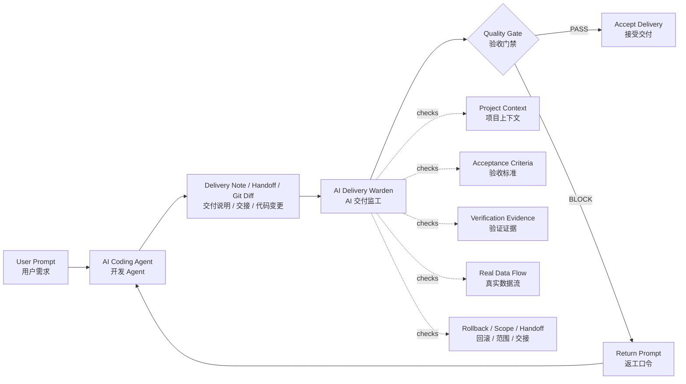
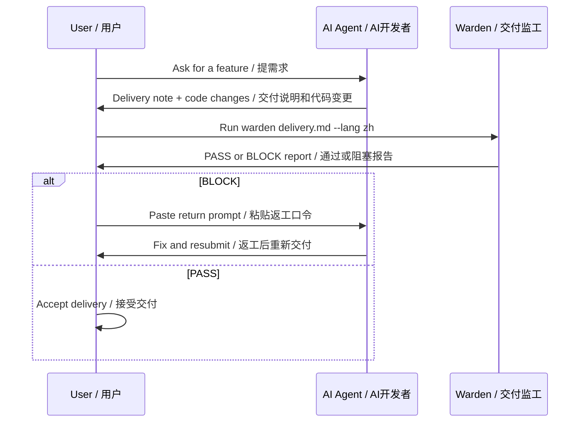

# AI Delivery Warden

**EN:** A local quality gate for AI-generated product and code deliveries.  
**中文：** 一个本地运行的 AI 交付监工工具，用来检查 AI 写完后的交付说明、交接内容和代码变更是否真的可验收。

> **EN:** No evidence, no delivery.  
> **中文：** 没有证据，不算交付。

AI coding agents are fast, but they often ship half-finished pages, fake buttons, mock data, missing tests, vague handoffs, accidental scope creep, and "should work" confidence without proof.

AI 编程 Agent 很快，但也经常交付半成品、假页面、假按钮、mock 数据、缺失测试、粗糙交接、擅自分期，以及“应该可以”这种没有证据的自信。

AI Delivery Warden does **not** write code for you. It reviews the agent's delivery and asks the uncomfortable questions before you accept the work.

AI Delivery Warden **不负责写代码**。它负责在你接受 AI 交付前，先替你问那些最容易被糊弄过去的问题。

---

## How It Works / 工作原理



---

## What It Catches / 它能抓什么

| EN | 中文 |
|---|---|
| No evidence that the agent read the project | 没有证据证明 AI 读过项目 |
| Missing acceptance criteria | 缺少验收标准 |
| Missing verification commands or results | 缺少验证命令或验证结果 |
| Fake UI or mock data risk | 假页面 / mock 数据风险 |
| Unauthorized phasing such as "MVP first" or "later" | 未经允许擅自分期，比如“先做 MVP”“后续再接” |
| Weak handoff notes that cannot restore context | 交接太粗，无法恢复现场 |
| Missing backup or rollback plan | 缺少备份或回滚方案 |
| Vague confidence such as "should work" | “应该可以”“理论上没问题”这类无证据自信 |
| Scope boundary not declared | 没有说明影响范围 |

---

## Install / 安装

```bash
git clone https://github.com/miaoxin1979/ai-delivery-warden.git
cd ai-delivery-warden
python3 -m pip install -e .
```

You can also run it without installation from the project directory:

也可以不安装，直接在项目目录里运行：

```bash
python3 -m ai_delivery_warden.cli examples/bad_delivery_zh.md --lang zh
```

---

## Usage / 使用

### English report

```bash
warden examples/bad_delivery.md
```

### 中文报告

```bash
warden examples/bad_delivery_zh.md --lang zh
```

### Review stdin / 检查标准输入

```bash
cat examples/bad_delivery.md | warden
```

### Review a delivery note plus current git diff / 同时检查交付说明和当前 git diff

```bash
warden delivery.md --git-diff --lang zh
```

### Write a report / 输出报告到文件

```bash
warden delivery.md --lang zh --output warden-report.md
```

---

## Real Workflow / 真实使用流程



---

## Example Output / 输出示例

```text
# AI 交付监工报告

- 状态：BLOCK
- 分数：0/100
- 问题数：8

## 问题清单

1. [CRITICAL] 缺少验证证据
   - 返工要求：没有命令输出、截图、接口返回或数据证据前，不接受交付。
```

---

## Status Meaning / 状态含义

| Status | EN | 中文 |
|---|---|---|
| PASS | No blocking issue found by current rules | 当前规则没有发现阻塞问题 |
| NEEDS_WORK | Issues found, but not critical | 有问题，需要补充 |
| BLOCK | Critical delivery risk found | 存在关键交付风险，不建议接受 |

---

## Philosophy / 理念

**EN:** AI Delivery Warden treats an AI agent like a delivery team, not a chatbot. The agent must prove the work is complete with context, acceptance criteria, real data flow, verification evidence, and a recoverable handoff.

**中文：** AI Delivery Warden 把 AI 当成交付团队来管理，而不是聊天助手。AI 必须用项目上下文、验收标准、真实数据流、验证证据和可恢复交接来证明自己真的完成了。

---

## Roadmap / 路线图

- Configurable rule packs / 可配置规则包
- JSON output for automation / JSON 输出，方便自动化
- GitHub PR review mode / GitHub PR 审查模式
- Screenshot and Playwright evidence checks / 截图和 Playwright 验证证据检查
- Handoff quality scoring / 交接质量评分
- Secret and destructive-change detection / 密钥和危险改动检测
- Project-specific rule files such as `WARDEN.md` / 支持项目级 `WARDEN.md` 规则文件

---

## License / 许可证

MIT
